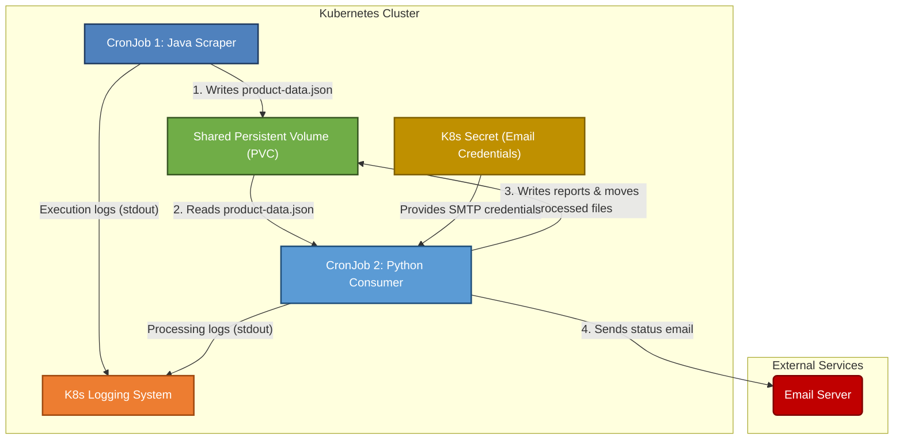

# Architecture Flow

This diagram illustrates the data flow and component interaction within the daily data pipeline when deployed on Kubernetes.

The central component is the Shared Persistent Volume, which allows the producer and consumer to work asynchronously.

## Explanation of Components

This architecture is designed for scheduled, asynchronous data processing within a Kubernetes environment.

#### 1. Kubernetes CronJobs
The entire pipeline is driven by two `CronJob` resources. A CronJob is a Kubernetes controller that runs a job on a repeating schedule.
-   **Java Scraper CronJob:** This is scheduled to run first (e.g., at 2:00 AM daily). Its sole purpose is to create a Pod to run the Java data producer.
-   **Python Consumer CronJob:** This is scheduled to run shortly after the scraper (e.g., at 2:15 AM). This delay ensures that the producer has had time to finish writing its data file before the consumer starts.

#### 2. Pods (Java Scraper & Python Consumer)
These are the ephemeral, short-lived containers where the applications run.
-   The **Java Scraper Pod** starts up, executes its `main` method to scrape and write one JSON file, and then terminates.
-   The **Python Consumer Pod** starts up, scans the `incoming/` directory for any files, processes them, generates reports, and sends an email notification with the status before terminating.
-   Because they are created by CronJobs, they are batch processes, not long-running services.

#### 3. Shared Persistent Volume (PVC)
This is the heart of the architecture and the key communication mechanism.
-   It's a request for a piece of network-attached storage that can be mounted by multiple pods simultaneously (`ReadWriteMany` access mode).
-   It completely decouples the producer from the consumer. The producer doesn't need to know if the consumer is running, and vice-versa. It simply drops a file in the "incoming" directory. This makes the system resilient; if the consumer fails, the data file remains on the volume, ready to be processed on the next run.

#### 4. Kubernetes Secret
To handle sensitive information like email credentials securely, a `Secret` resource is used.
-   The secret stores the SMTP host, port, username, and password.
-   The consumer pod mounts these secret values as environment variables, making them available to the Python script without hardcoding them in the image.

#### 5. K8s Logging System
The applications do not write log files to the shared volume. They write logs to **standard output** (stdout).
-   Kubernetes automatically captures everything written to stdout and stderr from a container.
-   This allows you to view the logs using `kubectl logs`. This is a standard practice that separates application data (the JSON files) from operational data (the logs).

#### 6. Email Notifications
The Python consumer sends an email at the end of its run to report the status (success or failure) of the pipeline. This provides a simple and effective monitoring and alerting mechanism.
